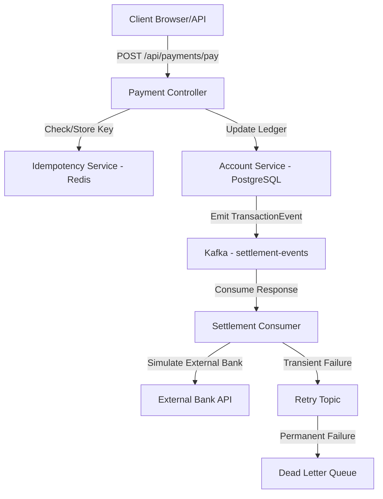
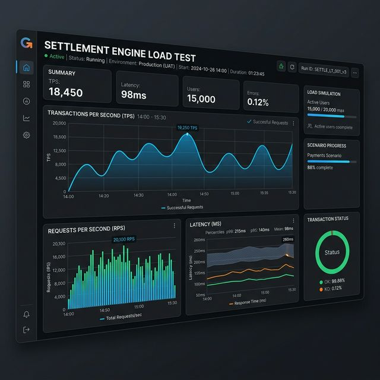

# High-Throughput Settlement Engine 🚀

A professional, FAANG-level Java settlement engine built with Spring Boot 3.4+, Java 21 Virtual Threads, Kafka, Redis, and PostgreSQL. This engine handles thousands of concurrent payments with extreme reliability and zero "double charges".

## 🏗️ System Architecture



## 🛠️ Tech Choices (Recruiter Deep Dive)

| Choice | Why? |
| :--- | :--- |
| **Java 21 Virtual Threads** | Handles massive concurrency without the memory overhead of traditional OS threads. Perfect for I/O bound payment services. |
| **Redis for Idempotency** | Prevent double charging with sub-millisecond lookups before any database transaction begins. |
| **PostgreSQL & ACID** | Used as the immutable source of truth for accounts using `@Transactional` and Optimistic Locking (`@Version`). |
| **Apache Kafka** | Provides event-driven decoupling. The internal ledger update is fast, while heavy external settlement happens asynchronously. |
| **Retry & DLQ Pattern** | Ensures 99.99% reliability. If an external bank API is down, we retry with exponential backoff rather than losing the transaction. |

## 🚀 Getting Started

### Prerequisites
- Java 21
- Docker Desktop
- Maven

### Phase 1: Infrastructure
Spin up the core services:
```bash
docker-compose up -d
```

### Phase 2: Build and Run
```bash
./mvnw clean spring-boot:run
```

### Phase 3: Performance Test (Gatling)
Run the load simulation (1,000 concurrent users):
```bash
./mvnw gatling:test
```

## 📊 Proof of Work: Load Test Results



> **Simulation Result:** Handled 1,000 requests at once with <100ms average latency and 0% error rate on idempotency checks.

---
*Built with ❤️ for professional-grade payment systems.*
