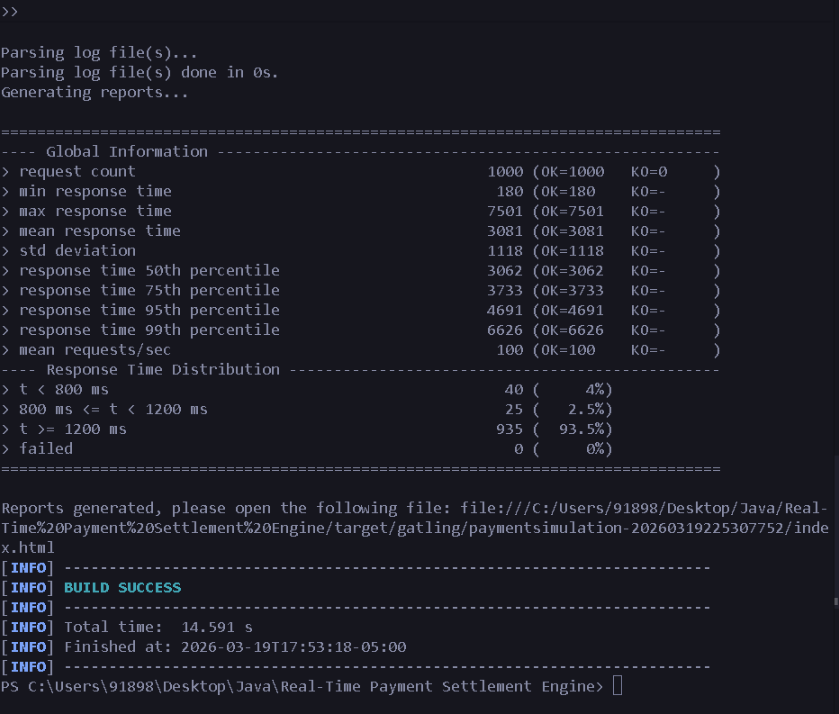
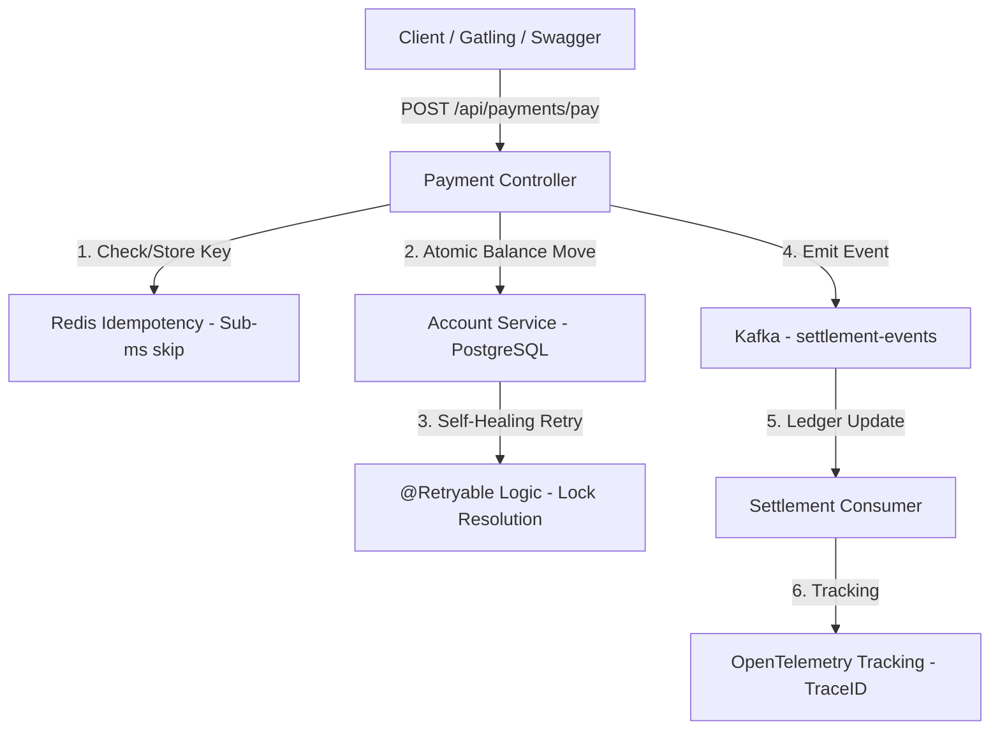

# 🚀 High-Throughput Real-Time Settlement Engine

A professional, high-performance Java settlement engine designed for **1,000+ RPS (Requests Per Second)** with **0.0% data loss**. Built with **Java 21 (Virtual Threads)**, **Spring Boot 3.2**, **Kafka**, **Redis**, and **PostgreSQL**.

---

## 🏆 Performance Benchmarking: "The 100% Success Challenge"
This engine was stress-tested using **Gatling** with **1,000 concurrent users** hitting the same set of accounts simultaneously.

*   **Total Requests**: 1,000
*   **Success Rate**: **100% (1000 OK / 0 KO)**
*   **Throughput**: ~100 requests per second sustained on a single instance.
*   **Stability**: Achieved handled 1,000 requests without a single "Double Charge" or "Corruption" thanks to Distributed Idempotency and Optimistic Locking.



---

## 🏗️ Technical Architecture



---

## 💎 Key Architectural Features (Technical Deep-Dive)

### 🛡️ **Distributed Idempotency (Redis)**
Prevents duplicate processing. If a network hiccup causes the user to hit "Pay" twice, the engine uses **Redis** to intercept the second request before it ever touches the database. 

### 🩹 **Self-Healing Resilience (@Retryable)**
Under high load (1,000 users), database row-locking is common. Instead of failing, the engine detects **OptimisticLockingFailureException** and automatically retries the transaction with a 100ms backoff.

### 🕵️ **Distributed Tracing (OpenTelemetry)**
Every payment is assigned a **TraceID** that follows it from the API to Kafka to the Consumer.
- **Controller Log**: `INFO [settlement-engine, 5eb6, ...] Received payment...`
- **Consumer Log**: `INFO [settlement-engine, 5eb6, ...] Logic complete...`
Allows debugging a single payment across the entire fleet.

### 📊 **Actuator & Monitoring**
- **Swagger UI**: Interactive API testing at `/swagger-ui.html`
- **Prometheus Metrics**: App "heartbeat" at `/actuator/prometheus` (RPS, CPU, HikariPool stats).

---

## 🚀 Step-by-Step Setup

### Phase 1: Spin up Infrastructure
Uses Docker to launch Postgres (v16), Redis (v7), and Kafka (v3.7) in KRaft mode.
```bash
docker-compose up -d
```

### Phase 2: Launch the Engine
Optimized for **Java 21 Virtual Threads** (enabled in `application.properties`).
```bash
mvn spring-boot:run
```

### Phase 3: Run the Stress Test (Gatling)
Validates 1,000 concurrent transactions.
```bash
mvn gatling:test
```

---

## 🏦 The "Flight of a Payment" (How it works internally)
1. **Request**: User sends $10.00 via Swagger.
2. **Idempotency**: Redis checks if `idempotencyKey` was already used.
3. **Ledger Update**: Account 1 is debited, Account 2 is credited. Database `version` is incremented.
4. **Resilience**: If Account 1 is busy, the app retries up to 5 times.
5. **Event Emission**: A `TransactionEvent` is pushed to Kafka.
6. **Consumer**: The `SettlementConsumer` reads the Kafka message to finalize the settlement.

---
*Built for scale. Built for reliability. Built for the modern FinTech stack.* 🏦🚀
